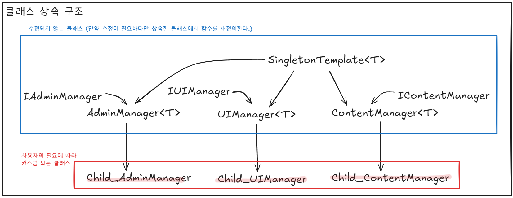
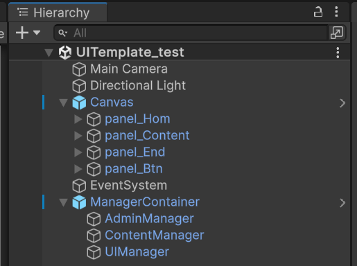
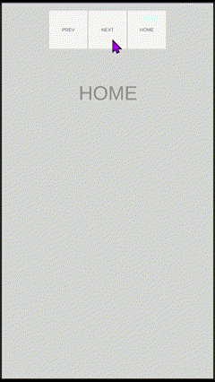

# UI Template 만들기

### INFO
- Unity Version : 2023.2.20f1
- OS : Windows 11

### 클래스 상속 구조

각 매니저 클래스는 싱글톤으로 이루어져 있으며, `Admin`/`UI`/`Content` 에 해당하는 추상클래스를 상속하여 이를 구현한다.

### 화면 구성

각 패널이 하나의 페이지를 의미하고 버튼의의 리스너 함수를 통해 각 페이지를 이동한다.

### 예제 영상
